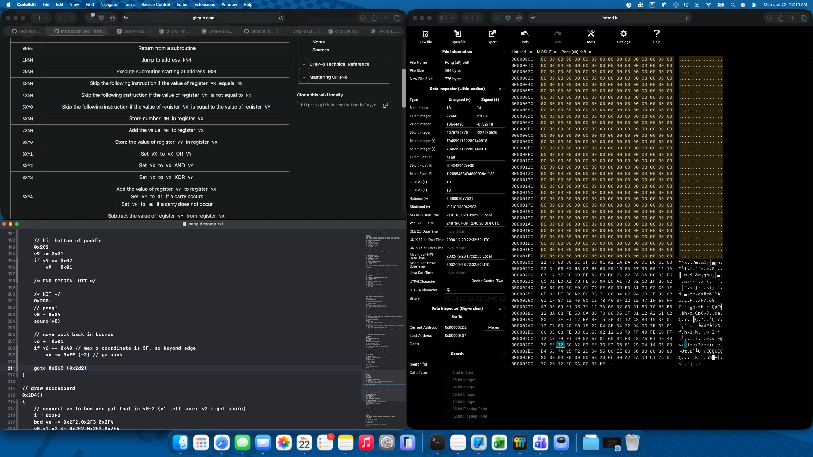

# Reverse Engineering CHIP-8 Pong: Decompilation Notes



Before starting to plan or write the main loop and memory management for this CHIP-8 emulator, I manually decompiled an existing compiled Pong ROM (`Pong (alt).ch8`) from machine code back into pseudocode.

The goal of this "Step 0" was to truly understand the CHIP-8 instruction set, register behavior, and standard program designs used in these systems.

## 1. The Decompilation Strategy
I started with by brute forcing translation line by line, taking raw hex opcodes and mapping them to their pseudocode equivalents, occasionally branching off to follow specific subroutines.

To extract the raw opcodes, I opened the rom using [hexed.it](https://hexed.it). My process was to read the hex pair by pair, map them against the standard CHIP-8 instruction set, and then interpret the instruction on my own into pseudocode.

As I kept writing, patterns in the register usage appeared. By analyzing the sprite drawing instructions (`DXYN`), I was able to differentiate between persistent state variables and temporary math registers:
* **Identifying Game Objects:** I noticed certain registers were consistently used to draw tall objects (a string of `0x80`s at `0x2EA` and beyond), which I realized were the paddles and the center line. Another set of registers handled 1-pixel objects (another `0x80` at `0x2F0`), representing the puck.
* **Register Mapping:** This allowed me to map `va`/`vb` to the left paddle coordinates, `vc`/`vd` to the right paddle, and `v6`/`v7` to the puck, while recognizing `v0`, `v1`, and `v2` as temporary registers used for quick state calculations.

## 2. Decoding the Scoreboard & BCD Logic
Understanding the score tracking required decoding an encoded register. Early in the decompilation, I mapped subroutine `0x2D4()`, which used the CHIP-8 Binary-Coded Decimal (BCD) opcode (`FX33`) on register `ve` to draw the scoreboard.

It wasn't until I reached the "paddle miss" logic at `0x278` and `0x282` that the system made sense. The game uses a single byte (`ve`) to track both scores. When a player scores, the game adds the value stored in `v3` to `ve`.
* If the left player scores, `v3` is set to `0x0A` (10).
* If the right player scores, `v3` is set to `0x01` (1).

By using the tens place for the left score and the ones place for the right score, the ROM packs the entire scoreboard state into a single register before passing it to the BCD converter for rendering.

## 3. The Biggest Challenge: Bounce Angle Logic
The most conceptually confusing section to reverse engineer was the logic handling the puck colliding with a paddle (starting around `0x28A`).

I identified two separate blocks of code that preloaded variables (`v8`, `v3`, `v0`), followed by a dense cluster of subtractions checking the `vf` flag. To understand this, I mapped out the math on paper:
1. **The Y-Coordinate Comparison:** The code compares the Y-coordinate of the puck against the Y-coordinate of the paddle that was just hit.
2. **Using the Borrow Flag:** In CHIP-8, a subtraction instruction sets the `vf` flag to `0x00` if a borrow occurs (if the subtracted value is larger). The code uses this to calculate the distance from the puck to the top of the paddle. If `vf == 0x00` immediately, the paddle is entirely below the puck (a miss from above).
3. **The `0x02` Subtraction Loop:** If it's a hit, the code repeatedly subtracts a constant of `0x02` from the distance:
    ```c++
    v1 = 0x02
    v0 -= v1 (vf = 0x00 if if v1>v0) // distance from 2nd from top pixels of paddle
    if vf != 0x01
        goto 0x2BA // hit top 2 pixels of paddle
        
    v0 -= v1 (vf = 0x00 if if v1>v0) // distance from 4th from top pixels
    if vf != 0x01
        goto 0x2C8 // hit middle of paddle
        
    v0 -= v1 (vf = 0x00 if borrow occurs) // distance from bottom of paddle
    if vf != 0x01
        goto 0x2C2 // hit bottom of paddle
    ```
    Because a paddle sprite is 6 bits tall, there are exactly three intervals of 2. This sequence determines whether the puck hit the top 2 pixels, the middle 2 pixels, or the bottom 2 pixels of the paddle (or simple missed from below).

Once I realized the code was calculating spatial intervals on the paddle surface, I knew this was the bounce-angle logic.

## 4. Lessons Learned for C++ Implementation
Through this decompilatoin, I realized a few architectural priorities for my C++ emulator:
* **ALU Precision is Critical:** Pong relies heavily on the `vf` (carry/borrow) flag for core game logic, not just math. Specifically, the collision detection will completely break if subtraction (`8XY5` and `8XY7`) doesn't handle the borrow flag correctly. I need to make sure this is implemented correctly using extra unit tests.
* **State Packing:** Computers back then did not have much memory. This was most visible when seeing how two scores were packed into a single byte (`ve`) before calling the BCD instruction. The BCD implementation needs to cleanly unpack these hundreds/tens/ones values so the rendering loop can draw the sprites correctly.
* **Sprite Rendering Limits:** The standard `DXYN` drawing opcode XORs pixels onto the screen. Pong uses this to both draw and erase previous paddle and puck positions before redrawing. I need to remember to do XOR operations when displaying, rather than just blindly drawing.